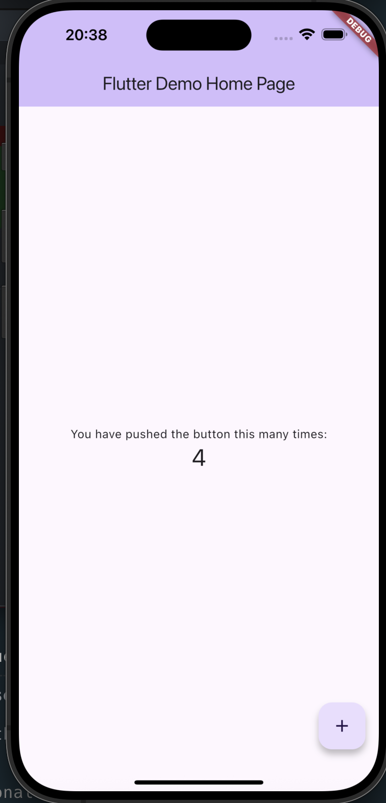
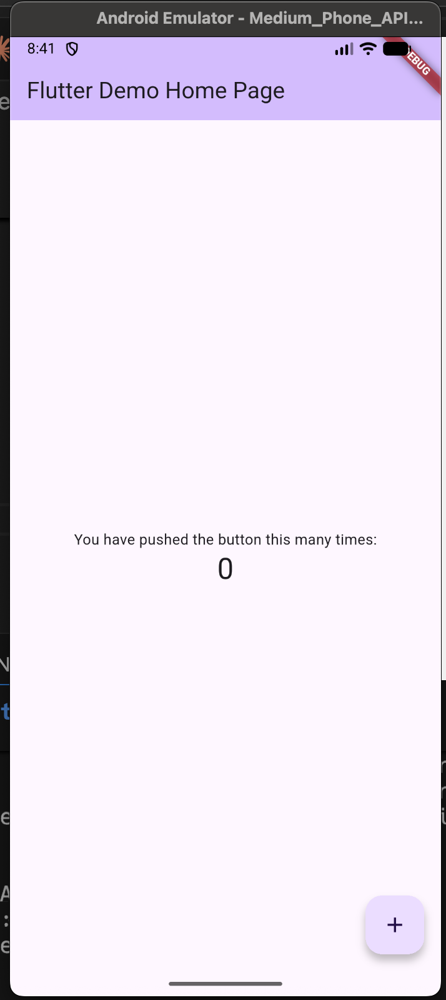

# Calorie Calculator App

A cross-platform mobile application built with Flutter

## Features

- print hello world on app ui

## Getting Started

### Prerequisites

- Flutter SDK
- Dart SDK
- iOS Simulator / Android Emulator or physical device

## how to run

### Clone the repository and get dependencies

```sh
git clone <repository_url>
git pull
cd <project_directory>
flutter pub get
```

### web Browser

프로젝트에 web 지원이 이미 추가되어 있습니다. 다음 명령어로 실행 가능:

```sh
flutter create --platforms web .
flutter run -d chrome
```

### iOS Simulator

simulator를 먼저 시작해야 함

```sh
# flutter create --platforms ios .
open -a Simulator
flutter run -d "iPhone 16 Plus"
# quit the simulator: Cmd + Q
```



### Android Emulator

flutter emulators # 사용 가능한 emulator 목록 확인

```sh
flutter create --platforms android .
```

```sh
Id                    • Name                  • Manufacturer • Platform
apple_ios_simulator   • iOS Simulator         • Apple        • ios
Medium_Phone_API_36.1 • Medium Phone API 36.1 • Generic      • android
```

```sh
flutter emulators --launch <emulator_id>  # emulator 시작
flutter emulators --launch Medium_Phone_API_36.1
flutter run -d emulator-5554
```



## platform 추가

```sh
# 모든 플랫폼 추가
flutter create --platforms ios,android,web,windows,linux,macos .
```

## device 보기

```sh
flutter devices

Found 4 connected devices:
sdk gphone64 x86 64 (mobile) • emulator-5554                        • android-x64    • Android 16 (API 36) (emulator)
iPhone 16 Plus (mobile)      • 84EBCFF8-CBE4-41EE-9CC7-C8032BD47185 • ios            • com.apple.CoreSimulator.SimRuntime.iOS-18-6 (simulator)
macOS (desktop)              • macos                                • darwin-x64     • macOS 15.5 24F74 darwin-x64
Chrome (web)                 • chrome                               • web-javascript • Google Chrome 143.0.7499.193

flutter emulators

Id                    • Name                  • Manufacturer • Platform
apple_ios_simulator   • iOS Simulator         • Apple        • ios
Medium_Phone_API_36.1 • Medium Phone API 36.1 • Generic      • android
```

## 전체 디바이스

```sh
flutter run -d all
```
